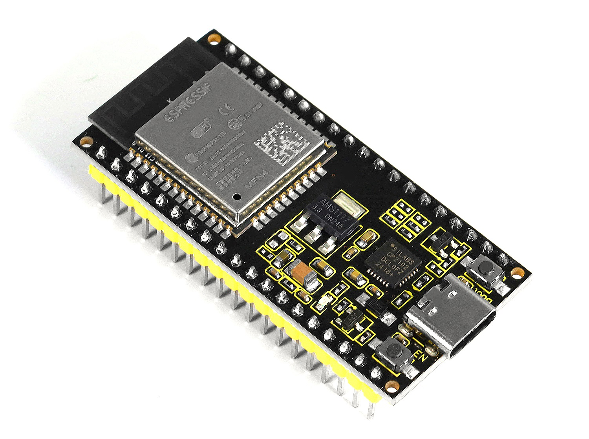
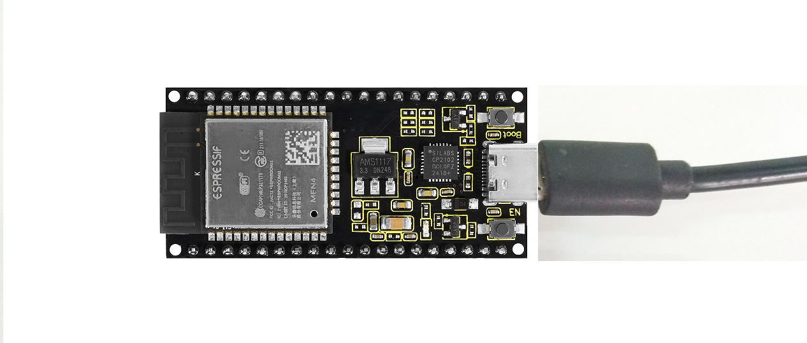
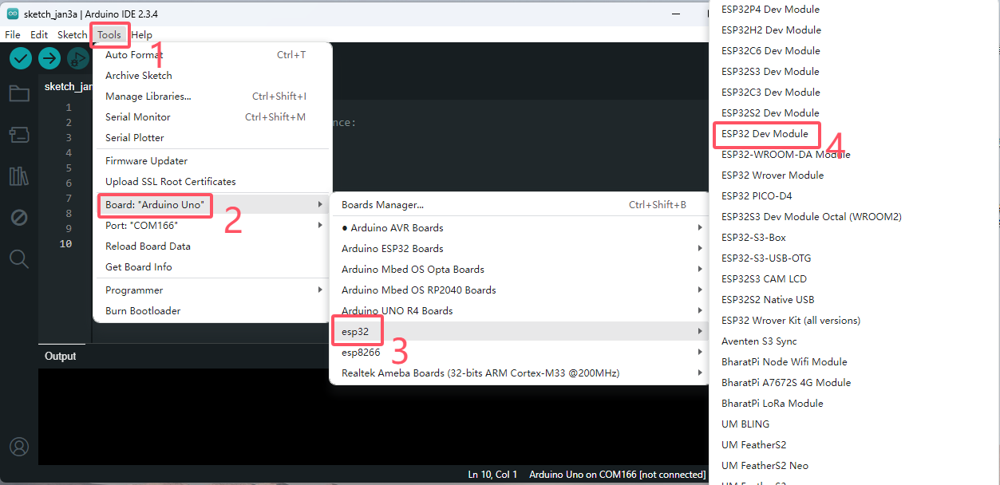

# **KS5019 Keyestudio ESP32 Core Board**


# 1.Description

This keyestudio ESP32 core board is a Mini development board based on the ESP-WROOM-32 module.

The board has brought out most I/O ports to pin headers of 2.54mm pitch. These provide an easy way of connecting peripherals according to your own needs.

When it comes to developing and debugging with the development board, the both side standard pin headers can make your operation more simple and handy.

The ESP-WROOM-32 module is the industry's leading integrated WiFi + Bluetooth solution with less than 10 external components.

It integrates antenna switch, RF balun, power amplifiers, low noise amplifiers, filters and power management modules.

At the same time, it also integrates with TSMC's low-power 40nm technology, so that power performance and RF performance are safe and reliable, easy to expand to a variety of applications.

# 2.Technical Details

- Microcontroller: ESP-WROOM-32 module

- USB to Serial Port Chip: CP2102-GMR

- Operating Voltage: DC 3.3V

- Operating Current: 80mA (average)

- Current Supply: 500mA (Minimum)

- Operating Temperature Range: -10℃ \~ +60℃

- WiFi mode: Station/SoftAP/SoftAP+Station/P2P

- WiFi protocol: 802.11 b/g/n（802.11n, speed up to 150 Mbps）

- WiFi frequency range: 2.4 GHz \~ 2.5 GHz

- Bluetooth protocol: conform to Bluetooth v4.2 BR/EDR and BLE standards

- Weight: 10.1g

- Dimensions: 56mm\*26mm\*16mm
  
  

# 3.Element and Interfaces

Here is an explanation of what every element and interface of the board has:


**Specialized Functions of Some Pins:**

| **PINS**      | **EXPLANATIONS**           |
|:-------------:|:--------------------------:|
| **IO23**      | VSPI MOSI/SPI MOSI         |
| **IO22**      | Wire SCL                   |
| **TXD0**      | IO1/Serial TX              |
| **RXD0**      | IO3/Serial RX              |
| **IO21**      | Wire SDA                   |
| **IO19**      | VSPI MISO/SPI MISO         |
| **IO18**      | VSPI SCK/SPI SCK           |
| **IO5**       | VSPI SS/SPI SS             |
| **IO4**       | ADC10/TOUCH0               |
| **IO0**       | ADC11/TOUCH1               |
| **IO2**       | ADC12/TOUCH2               |
| **IO15**      | HSPI SS/ADC13/TOUCH3/TDO   |
| **SD1**       | IO8/FLASH D1               |
| **SD0**       | IO7/FLASH D0               |
| **CLK**       | IO6/FLASH SCK              |
| **CMD**       | IO11/FLASH CMD             |
| **SD3**       | IO10/FLASH D3              |
| **SD2**       | IO9/FLASH D2               |
| **IO13**      | HSPI MOSI/ADC14/TOUCH4/TCK |
| **IO12**      | HSPI MISO/ADC15/TOUCH5/TDI |
| **IO14**      | HSPI SCK/ADC16/TOUCH6/TMS  |
| **IO27**      | ADC17/TOUCH7               |
| **IO26**      | ADC19/DAC2                 |
| **IO25**      | ADC18/DAC1                 |
| **IO33**      | ADC5/TOUCH8                |
| **IO32**      | ADC4/TOUCH9                |
| **IO35**      | ADC7                       |
| **IO34**      | ADC6                       |
| **SENSOR VN** | IO39/ADC3                  |
| **SENSOR VP** | IO36/ADC0                  |
| **EN**        | RESET                      |

# 4.Detailed Using Method as follows

## Step1 Install the Arduino IDE

When programming the control board, first you should install the Arduino software and driver.

You can download the different versions for different systems from the link below:

<https://www.arduino.cc/en/Main/OldSoftwareReleases#1.5.x>

This control board is compatible with the Arduino 1.8.7 or latest version.

So next we will download the Arduino 2.3.4 software to test the keyestudio ESP32 core board.      
<https://www.arduino.cc/en/software>


In this Windows system page, there are two options. One is Windows version, the other is Windows Installer.

For Windows Installer, you can download the installation file, this way you need to install the arduino IDE.


For simple Windows version, you can download the software directly, do not need to install, just directly use the software after unzip the package.


Next, we click the **Windows**, pop up the interface as below.


Click **JUST DOWNLOAD**.

Downloaded well the **arduino-2.3.4-windows-64bit.zip** package to your computer, you need to create a new folder, and then unzip the package into the new folder.


Click the icon(Arduino IDE.exe) of Arduino software to open. This is your Arduino.


## Step2 Installing the Driver

The USB to serial port chip of this control board is Silabs-CP2102. So you need to install the driver for the chip.

We provide driver downloads link:
[https://fs.keyestudio.com/CP2102-WINDOWS](https://fs.keyestudio.com/CP2102-WINDOWS)

Silabs provide driver downloads link:
[https://www.silabs.com/developer-tools/usb-to-uart-bridge-vcp-drivers](https://www.silabs.com/developer-tools/usb-to-uart-bridge-vcp-drivers)


It includes different drivers for different computer’s systems. Download and install the driver according to your computer’s system.

For example, we download the driver for Windows 10. Get the compression package of CP210x\_Windows\_Drivers


Then extract the compression package, you should see the application to install.


The driver software installation is very simple. Just select the driver application as you like.

Click to **.exe** package to install the driver. Click “Next”.


Click to select “I accept this agreement” and click “Next”.


Wait for the installation complete. Finally click “Finish” to close the window.


## Step3 Building ESP32 Environment

Click on the following menu:


Add the following link to the IDE:          
https://espressif.github.io/arduino-esp32/package_esp32_index.json


Add ESP32 board type:  


succeed!


## Step4 Arduino IDE Toolbar and Setting

The functions of each button on the Toolbar are listed below:


|                                   |                                                               |
| --------------------------------- | ------------------------------------------------------------- |
| *Verify*         | Check the code for errors                                     |
| *Upload*         | Upload the current Sketch to the Arduino                      |
| *Debugging*      | Create a new blank Sketch                                     |
| *Serial Plotter* | Show a list of Sketches                                       |
| *Serial Monitor* | Display the serial data being sent from the development board |

Attach your ESP32 core board to your computer with the USB cable.



Check that the “Board Type”and “Serial Port” are set correctly.

Click to open the “**Tools”**, for “**Board”**, scroll to select the ESP32 Dev Module.



Select well the correct board and then should set the detailed information as shown below.


Pay close attention to select the proper **COM** port. (Arduino driver installed well, you are supposed to see the corresponding port.)

Check out the COM port in the Device Manager of your computer’s control panel.


Here we can know the COM port is COM 8. Then select the Port COM 8 in the Arduino Tools.


## Step5 Upload the Code

Create a new sketch:


Paste and copy the source code below to Arduino IDE.

```c++
/*
This sketch demonstrates how to scan WiFi networks.
The API is almost the same as with the WiFi Shield library,
the most obvious difference being the different file you need to include:
*/

#include "WiFi.h"

void setup()
{
Serial.begin(115200);
// Set WiFi to station mode and disconnect from an AP if it was previously connected
WiFi.mode(WIFI_STA);
WiFi.disconnect();
delay(100);
Serial.println("Setup done");
}

void loop()
{
Serial.println("scan start");
// WiFi.scanNetworks will return the number of networks found
int n = WiFi.scanNetworks();
Serial.println("scan done");

if (n == 0) 
{
    Serial.println("no networks found");
} 
else 
{
    Serial.print(n);
    Serial.println(" networks found");
    for (int i = 0; i < n; ++i) {
        // Print SSID and RSSI for each network found
        Serial.print(i + 1);
        Serial.print(": ");
        Serial.print(WiFi.SSID(i));
        Serial.print(" (");
        Serial.print(WiFi.RSSI(i));
        Serial.print(")");
        Serial.println((WiFi.encryptionType(i) == WIFI_AUTH_OPEN)?" ":"*");
        delay(10);
    }
}

Serial.println("");
// Wait a bit before scanning again
delay(5000);
}
```

Click verify button to check the errors. If compiling successfully, the message "Done compiling." will appear in the status bar.


After that, click the “Upload” button to upload the code. If the upload is successful, the message "Done uploading." will appear in the status bar.

**Special Note:** if fail to upload, when upload the source code, hold the BOOT button on the ESP32 board until upload well the code.


Done uploading the code to your board, open the serial monitor and set the baud rate to 115200. You should be able to see the WIFI information on the pop-up window.


End.
